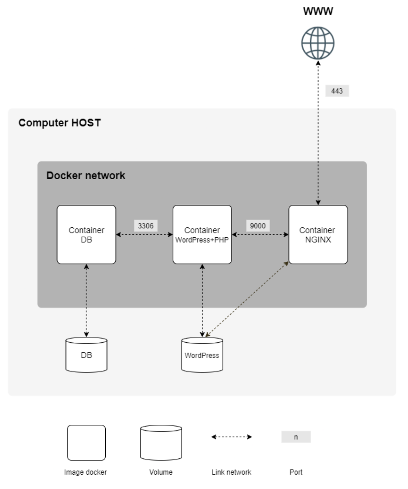

Ce repo contient mes notes prises un peu en vrac lors de la réalisation du projet inception de l'école 42.
Beaucoup de texte vient de chatgpt, claude, gemini.
Certains paragraphes se répètent, certains ne sont pas pertinents dans le contexte de docker, certains sont mieux compréhensibles après en avoir lu d'autres, certains sont peut-être erronés.


Pour inception, je vous suggère de:
1. Regarder le cours de Mohamed Youssfi https://www.youtube.com/watch?v=hJpHCmJHOtw&t=18s.
2. Faire le workshop https://docs.docker.com/get-started/workshop/.
3. Télécharger une image alpine (ou debian)
4. Créer un conteneur de l'image alpine. Lisez un peu la documentation MariaDB. Télécharger, installer, configurer MariaDB. Créer une base de données et un utilisateur mysql. Une fois que vous avez compris, automatiser tout ça avec le dockerfile et refaites un conteneur en le mettant dans un réseau et en mappant un volume.
5. Faites la même chose pour nginx.
6. Pour une première prise en main de wordpress, lisez la docu et installer tout (wordpress, php, mariadb, nginx) dans un même conteneur de test. Configurer manuellement wordpress, essayer de mettre en place votre site wordpress, écrivez votre dockerfile. etc...
7. Orchestrer le tout avec docker-compose.

https://www.youtube.com/watch?v=hJpHCmJHOtw&t=18s  
https://docs.docker.com/get-started/workshop  
https://nginx.org/en/docs/beginners_guide.html  
https://nginx.org/en/docs/http/configuring_https_servers.html  
https://tuto.grademe.fr/inception/  
https://developer.wordpress.org/advanced-administration/before-install/howto-install/  
...


---

# INDEX

[Docker - Introduction](#docker---introduction)  
[Les composants Docker](#les-composants-docker)  
[Une seule application pour un conteneur](#une-seule-application-pour-un-conteneur)  
[Instructions principales du Dockerfile](#instructions-principales-du-dockerfile)  
[Commandes Docker](#commandes-docker)  
[Comment s'arrête un conteneur ? En arrêtant le PID1](#comment-sarrête-un-conteneur-en-arrêtant-le-pid1)  
[Alpine et Debian](#alpine-et-debian)  
[Le serveur web Nginx](#le-serveur-web-nginx)  
[MariaDB](#mariadb)  
[Wordpress et php-fpm](#wordpress-et-php-fpm)  
[Docker Swarm](#docker-swarm)  
[Docker Secrets](#docker-secrets)  

[Protocole](#protocole)  
[HTTP](#http)  
[SSL/TLS](#ssltls)  
[Pile réseau et TCP/IP](#pile-réseau-et-tcpip)  
[CGI](#cgi)  
[Socket](#socket)  
[DNS et résolution locale](#dns-et-résolution-locale)  
[Interface](#interface)  
[API](#api)  
[OS (Operating system)](#os-operating-system)  

[Construction de mon infrastructure inception](#construction-de-mon-infrastructure-inception)  
[Fonctionnement d'Inception](#fonctionnement-dinception)  

---

## Docker - Introduction

**Docker** est un outil qui permet de faire tourner des applications dans des conteneurs. Un conteneur est comme une petite boîte qui contient tout ce qu’il faut pour faire tourner une application : le code, les bibliothèques, les dépendances, etc. Peu importe l’ordinateur sur lequel on exécute le conteneur, **l'application fonctionnera toujours de la même manière**.

### Pourquoi c’est utile ?
- Éviter les problèmes du genre “Ça marchait sur mon PC mais pas sur le tien”.
- C’est rapide à installer, léger, et facile à déployer.
- Idéal pour les développeurs, les testeurs et les systèmes en production ('en production' est un terme qui désigne l'environnement où une application est mise à la disposition des utilisateurs finaux).
- Meilleures performances que les VM (Démarrage instantané).

### Différences entre VM et conteneur
**Machine Virtuelle (VM) :**
- Virtualise le **matériel complet**
- Chaque VM contient un **système d'exploitation complet** (OS invité)
- Utilise un **hyperviseur** (VMware, VirtualBox, Hyper-V) qui s'exécute sur l'OS hôte
- Chaque VM est totalement **isolée** avec ses propres ressources virtuelles
**Conteneur Docker :**
- Virtualise seulement **l'espace utilisateur**
- Partage le **même noyau** que l'OS hôte
- Utilise le **moteur Docker** qui s'interface directement avec l'OS hôte
- Les conteneurs partagent les ressources du système hôte

En résumé : une VM virtualise le matériel, alors qu’un conteneur virtualise uniquement l’espace applicatif.

---
## Les composants Docker

### **Docker Engine (Moteur Docker)**

Cœur de Docker, c'est un logiciel léger qui gère les conteneurs. Il fonctionne comme un **client-serveur** et comprend :
- **Docker Daemon (`dockerd`)** : Le serveur
    C'est le processus principal qui s'exécute en arrière-plan et écoute les requêtes de l'API Docker et gère les objets Docker comme les images, conteneurs, réseaux et volumes et qui expose une **REST API** (Application Programming Interface), une interface qui permet aux clients d'interagir avec le daemon Docker.
- **Docker CLI (`docker`)** : Le client
	L'interface textuelle (entre l'utilisateur et le client) en ligne de commande pour interagir avec le Daemon (ex: `docker run`, `docker build`). Il est simplement un programme léger qui traduit vos commandes en requêtes HTTP standard (GET, POST, PUT, DELETE) vers l'API du Daemon.


Par exemple :
- Lorsque vous tapez `docker ps` pour lister les conteneurs en cours, le CLI envoie une requête **`GET /containers/json`** à l'API du Daemon.
- Lorsque vous tapez `docker run ...` pour démarrer un nouveau conteneur, le CLI envoie une requête **`POST`** à l'API du Daemon pour créer ce conteneur.
- Lorsque vous tapez `docker rm <id>` pour supprimer un conteneur, le CLI envoie une requête **`DELETE`** à l'API.

Cette communication se fait généralement de manière locale via un socket Unix (`/var/run/docker.sock` sur Linux) ou un Named Pipe sur Windows. Cependant, il est également possible de configurer le Docker Daemon pour qu'il écoute sur un port TCP, ce qui permet à un client Docker distant de se connecter et de gérer les conteneurs d'un autre serveur.

### **Images Docker**

Les images sont des modèles en lecture seule qui contiennent tout le nécessaire pour exécuter une application : le code, les bibliothèques, les dépendances et les fichiers de configuration. Elles sont construites à partir de Dockerfiles et organisées en couches (chaque instruction dans un Dockerfile ajoute une couche), ce qui permet leur réutilisations et partages.
Quand vous lancez `docker build -t mon_image .` Docker envoie tout le contenu du répertoire courant au daemon docker, même si le dockerfile ne copie qu'une partie des fichiers. Un fichier .dockerignore (même fonctionnement que .gitignore) permet d'ignorer certains fichiers, et ainsi d'optimiser le processus de construction.

### **Conteneurs Docker**

Un conteneur Docker est une instance d'une image qui encapsule une application et toutes ses dépendances dans un environnement **isolé**. C'est comme une "boîte" standardisée qui contient tout ce dont votre application a besoin pour fonctionner. Un conteneur partage le noyau du système d'exploitation hôte, contrairement aux machines virtuelles qui nécessitent leur propre OS complet. 
Les conteneurs sont temporaires par défaut. Quand ils sont supprimés, les données créées à l'intérieur disparaissent, sauf si on utilise des volumes pour faire persister les données.

Isolation ne signifie pas déconnexion: un conteneur est isolé mais pas coupé d'Internet. Quand vous exécutez `docker run -it mon_image_alpine`, Docker crée automatiquement un réseau virtuel appelé bridge qui attribue une adresse IP privée au conteneur et fournit un accès Internet via NAT (Network Address Translation). Ce système fonctionne exactement comme votre ordinateur qui se connecte à Internet via votre box ou routeur.

**Un conteneur devient accessible par la mappage d'un port**. Un port dans Docker est une interface de communication réseau utilisée pour permettre à un conteneur de communiquer avec l'extérieur (par exemple ton ordinateur, d'autres conteneurs ou Internet).
Concrètement :
- Chaque conteneur Docker fonctionne de manière isolée dans son propre espace réseau.
- Pour accéder à un service tournant dans un conteneur (par exemple un serveur web sur le port 80), tu dois publier ce port.
- Cela se fait en associant (ou "mappant") un port de ta machine hôte (ton PC) à un port du conteneur.
**Exemple :**
`docker run -p 8080:80 my_image`
Ici, Docker fait un "pont" entre ton ordinateur et ton conteneur : tout ce qui arrive sur `localhost:8080` est envoyé au conteneur sur son port `80`.

### **Docker Registry**

Un dépôt d'images Docker (public ou privé). Docker Hub est le registry public par défaut.

### **Dockerfile**

Un fichier texte contenant les instructions pour construire automatiquement une image Docker. Il définit l'environnement d'exécution, les dépendances à installer et les commandes à exécuter.

### **Docker Network**

Docker crée des réseaux virtuels pour permettre aux conteneurs de communiquer entre eux ou avec l'extérieur, tout en maintenant l'isolation.
**Le réseau bridge par défaut** est créé automatiquement quand vous lancez un conteneur. Il attribue une adresse IP privée au conteneur et lui donne accès à Internet via NAT, tout en l'isolant des autres conteneurs non connectés au même réseau.
**Le réseau host** fait que le conteneur partage directement l'interface réseau de la machine hôte, comme s'il s'exécutait directement sur le système sans isolation réseau.
**Le réseau none** isole complètement le conteneur du réseau - il n'a aucune connectivité.
**Les réseaux personnalisés** permettent de créer des réseaux sur mesure où vous choisissez quels conteneurs peuvent communiquer entre eux. Les conteneurs sur le même réseau personnalisé peuvent se joindre par leur nom (résolution DNS automatique).
Docker gère automatiquement le routage, les adresses IP et les règles de pare-feu.

### **Docker Volumes**

Un système de stockage persistant qui permet aux données de persister facilitant le partage de données entre conteneurs ou avec l'hôte. Les volumes sont créés sur le disque dur et stockés par défaut dans `/var/lib/docker/volumes/`.

### **Docker Compose**

Un outil pour définir et gérer des applications multi-conteneurs en utilisant un fichier YAML. Au lieu de lancer chaque conteneur manuellement avec `docker run`, vous pouvez tout configurer dans un seul fichier. Il permet d'orchestrer plusieurs conteneurs qui travaillent ensemble.

### **Docker Swarm**

Mode natif d'orchestration de Docker permettant de déployer, gérer et mettre à l’échelle des services de conteneurs sur un cluster de machines (appelé un **Swarm**).
Intégré à Docker, il est plus simple à configurer et adapté aux petits/moyens clusters.
Kubernets, plus complexe et puissant, largement adopté dans l’industrie pour les gros environnements de production.

---
## Une seule application pour un conteneur

Techniquement, un conteneur _peut_ contenir plusieurs applications, mais ce n’est pas recommandé dans la philosophie Docker.  
En général, on met une seule application principale par conteneur.

Raisons pour cette approche
1. **Simplicité** : Un conteneur unique pour chaque application facilite le déploiement, la surveillance et la gestion des erreurs.
2. **Modularité** : Chaque service (par exemple, une API web, une base de données, un service de cache) est isolé dans son propre conteneur. Cela permet de les mettre à jour, redémarrer ou remplacer indépendamment.
3. **Portabilité** : Un conteneur avec une seule application est plus prévisible et fonctionne de la même manière dans tous les environnements.

---
## Instructions principales du Dockerfile

**FROM** - Définit l'image de base à partir de laquelle construire votre image  
**RUN** - Exécute des commandes dans le conteneur pendant la construction  
**COPY** - Copie des fichiers/dossiers depuis l'hôte vers le conteneur  
**WORKDIR** - Définit le répertoire de travail pour les instructions suivantes  
**ENV** - Définit des variables d'environnement  
**EXPOSE** - Indique (ne publie pas) le port sur lequel l'application écoute  
**CMD** - Définit la commande par défaut à exécuter au démarrage du conteneur. Cette commande peut être écrasée lors de l'éxecution du conteneur.  
**ENTRYPOINT** - Définit le point d'entrée du conteneur (non modifiable)  
**VOLUME** - Crée un point de montage pour les données persistantes  

---

## Commandes Docker

Listes non-exhaustives
### Images
| Commande                       | Description                                  |
| ------------------------------ | -------------------------------------------- |
| `docker build -t nom_image .`  | Construit une image à partir d’un Dockerfile |
| `docker images`                | Liste toutes les images disponibles          |
| `docker rmi nom_image`         | Supprime une image                           |
| `docker pull nom_image`        | Télécharge une image depuis Docker Hub       |
| `docker tag image nouveau_nom` | Renomme ou retague une image                 |

### Conteneurs
| Commande                                 | Description                                         |
| ---------------------------------------- | --------------------------------------------------- |
| `docker run nom_image`                   | Lance un conteneur                                  |
| `docker run -it nom_image`               | Lance un conteneur en mode interactif avec terminal |
| `docker run -d nom_image`                | Lance un conteneur en arrière-plan (détaché)        |
| `docker run -p hôte:conteneur nom_image` | Lie un port du conteneur à un port local            |
| `docker ps`                              | Liste les conteneurs en cours d’exécution           |
| `docker ps -a`                           | Liste **tous** les conteneurs (actifs et arrêtés)   |
| `docker stop id_ou_nom`                  | Arrête un conteneur                                 |
| `docker start id_ou_nom`                 | Démarre un conteneur arrêté                         |
| `docker restart id_ou_nom`               | Redémarre un conteneur                              |
| `docker rm id_ou_nom`                    | Supprime un conteneur                               |

### Inspection et déboguage
| Commande                       | Description                                                |
| ------------------------------ | ---------------------------------------------------------- |
| `docker logs id_ou_nom`        | Affiche les logs d’un conteneur                            |
| `docker exec -it id_ou_nom sh` | Ouvre un terminal dans un conteneur (si sh est dispo)      |
| `docker inspect id_ou_nom`     | Affiche des infos détaillées sur un conteneur ou une image |
| `docker top id_ou_nom`         | Montre les processus actifs dans le conteneur              |

### Nettoyage
| Commande                 | Description                                           |
| ------------------------ | ----------------------------------------------------- |
| `docker system prune`    | Supprime les conteneurs, images et volumes inutilisés |
| `docker image prune`     | Supprime les images non utilisées                     |
| `docker container prune` | Supprime les conteneurs arrêtés                       |
| `docker volume prune`    | Supprime les volumes non utilisés                     |

### Volumes
| Commande                           | Description           |
| ---------------------------------- | --------------------- |
| `docker volume create mon_volume`  | Crée un volume        |
| `docker volume ls`                 | Liste les volumes     |
| `docker volume inspect mon_volume` | Détails sur un volume |
| `docker volume rm mon_volume`      | Supprime un volume    |

### Network
| **Commande**                                     | **Description**                                                    |
| ------------------------------------------------ | ------------------------------------------------------------------ |
| `docker network ls`                              | Liste tous les réseaux Docker.                                     |
| `docker network create <nom>`                    | Crée un nouveau réseau.                                            |
| `docker network create --driver bridge <nom>`    | Crée un réseau de type _bridge_.                                   |
| `docker network inspect <nom>`                   | Affiche les détails d’un réseau (conteneurs, configuration, etc.). |
| `docker network rm <nom>`                        | Supprime un réseau.                                                |
| `docker network prune`                           | Supprime tous les réseaux non utilisés.                            |
| `docker network connect <réseau> <conteneur>`    | Connecte un conteneur à un réseau existant.                        |
| `docker network disconnect <réseau> <conteneur>` | Déconnecte un conteneur d’un réseau.                               |

### Docker compose
| **Commande**                           | **Description**                                                    |
| -------------------------------------- | ------------------------------------------------------------------ |
| `docker-compose up`                    | Démarre les services définis dans le fichier `docker-compose.yml`. |
| `docker-compose up -d`                 | Démarre les services en arrière-plan (mode détaché).               |
| `docker-compose down`                  | Arrête et supprime les conteneurs, réseaux, volumes, etc.          |
| `docker-compose logs`                  | Affiche les logs des services.                                     |
| `docker-compose logs -f`               | Affiche les logs en temps réel.                                    |
| `docker-compose down -v`               | Supprime aussi les volumes associés.                               |
| `docker-compose down --rmi all`        | Supprime les images créées avec `build`.                           |

---
## Comment s'arrête un conteneur ? En arrêtant le PID1

Le **PID 1** d’un conteneur Docker est **le premier processus lancé à l’intérieur du conteneur**, souvent spécifié par CMD ou ENTRYPOINT. Si une commande n'est pas spécifiée, c'est la commande de l'image de base qui sera lancée. Pour une image alpine ou debian, c'est un shell qui est lancé. Tant que PID1 tourne, le conteneur reste actif. Si le PID1 est interrompu, en sortant du shell par exemple, le conteneur s'arrête. Si le PID1 est un programme qui s'exécute en arrière-plan, le continuera à tourner même si vous en sortez. Si votre ENTRYPOINT d'un conteneur est un script, c'est tout ce script qui est le PID1. Avec la commande 'exec', vous pouvez remplacer le processus courant, votre script, par un autre qui ne s'arrêtera pas.

---
## `latest` (la dernière version d'une image) n'est pas recommandé

Même s’il semble pratique, `latest` est **ambigu** :
- Il **ne garantit pas une version stable ou reproductible**.
- Il peut **changer sans préavis** si tu reconstruis l’image plus tard.
- En production ou dans un projet noté (comme Inception), on veut des **versions explicites et stables**.

---

## **Alpine et Debian**

**Alpine** et **Debian** sont deux distributions Linux couramment utilisées comme images de base pour les conteneurs Docker. Elles ont des caractéristiques très différentes, ce qui influence leur utilisation dans des environnements conteneurisés.
### Alpine Linux
- **Taille ultra-légère** (~5 Mo seulement)
- **Sécurité renforcée** : Conçue pour la minimalisme, avec peu de paquets préinstallés (moins de surface d'attaque).
- **Performances** : Moins gourmande en ressources, idéale pour les microservices et les conteneurs éphémères.
- **Gestion des paquets** : Utilise `apk` (Alpine Package Keeper).
**Quand l'utiliser ?**
- Pour des conteneurs optimisés (production, CI/CD).
- Quand la taille de l'image est critique.
- Pour des applications compatibles avec `musl libc` (certains binaires peuvent poser problème).
### Debian
- **Taille plus grande** (~100 Mo pour l'image minimale `debian:stable-slim`).
- **Stabilité et compatibilité**
- **Écosystème riche** : Accès à des milliers de paquets via `apt`.
- **Convivialité** : Meilleure compatibilité avec les logiciels traditionnels.
**Quand l'utiliser ?**
- Pour des applications nécessitant une compatibilité maximale (ex: Python, Ruby, Java).
- En développement pour éviter les problèmes liés à `musl libc`.
- Si Alpine pose des problèmes avec des binaires propriétaires ou certaines librairies.

En résumé : **Alpine pour la légèreté, Debian pour la compatibilité**

---
## Le serveur web Nginx

Un client désigne généralement un programme ou un appareil qui demande et utilise des services fournis par un autre programme, appelé "serveur".

Un serveur web est un logiciel ou une machine qui stocke, traite et délivre des pages web et autres ressources (images, fichiers CSS/JS, API) à des clients  comme des navigateurs web, applications mobiles/de bureau ou CLI (Command Line Interface).

Lorsque vous ouvrez un navigateur comme Chrome ou Firefox et que vous tapez une adresse (URL), votre navigateur agit comme un client.
1. Le navigateur envoie une requête au serveur qui héberge le site web.
2. Le serveur répond en lui envoyant les données de la page (HTML, CSS, JavaScript, images).
3. Le navigateur affiche ces données.

Lorsque vous utilisez une application sur votre smartphone (par exemple, l'application Facebook ou une application bancaire), cette application est un client.
1. Elle envoie des requêtes à un serveur distant pour obtenir des données (par exemple, votre fil d'actualité ou le solde de votre compte).
2. Le serveur traite la demande et lui renvoie les informations nécessaires.

**NGINX** (prononcé "engine-x") est un serveur web hautement performant, souvent utilisé comme reverse proxy, load balancer (répartiteur de charge), et cache HTTP. Il est réputé pour sa stabilité, sa faible consommation de ressources et sa capacité à gérer des milliers de connexions simultanées grâce à une architecture asynchrone et événementielle.
##### **Rôles principaux de NGINX**
- **Serveur Web** : Livre des pages HTML, images, fichiers statiques (plus rapide qu'Apache dans certains cas).
- **Reverse Proxy** : Redirige les requêtes vers des serveurs backend (ex: une API Node.js, Python ou PHP-FPM).
- **Load Balancer** : Répartit le trafic entre plusieurs instances d'une application.
- **Cache HTTP** : Accélère les réponses en stockant des versions statiques des pages.
- **Terminaison SSL/TLS** : Gère les certificats HTTPS pour sécuriser les connexions.


Comment installer nginx ? Lisez la documentation ou les commentaires de mes fichiers.

---

## MariaDB

MariaDB est un système de **gestion de bases de données** relationnelles (SGBD) forké de MySQ en 2009, après le rachat de MySQL par Oracle. Il est 100% compatible MySQL, mais avec des améliorations en performance, sécurité et fonctionnalités.
Open-source et gratuit (contrairement à certaines versions de MySQL).  
Plus rapide que MySQL dans certains benchmarks (optimisation des requêtes).  
Moteurs de stockage avancés (InnoDB, MyRocks, ColumnStore).
Communauté active (développé par les créateurs originaux de MySQL).

Architecture client-serveur:
- Le serveur (`mysqld`): 
  Gère les données, requêtes SQL, sécurité, transactions. 
  Écoute en permanence sur un port réseau (généralement 3306) ou une socket unix, attendant que des clients se connectent pour lui envoyer des requêtes.
- Les clients:
  Se connectent au serveur via des outils comme: ligne de commande (`mysql`), interfaces graphiques (adminer), applications et envoient leurs requêtes.

Pourquoi cette séparation ?
Cette architecture client-serveur offre plusieurs avantages majeurs :
1. **Centralisation des données :** Toutes les données sont stockées et gérées à un seul endroit (le serveur), ce qui facilite la maintenance, la sauvegarde et la cohérence.
2. **Accès à distance :** Le client peut être sur n'importe quelle machine (même un smartphone) et se connecter au serveur via le réseau, permettant un accès distant aux données.
3. **Sécurité :** Le serveur peut authentifier et autoriser les clients, contrôlant précisément qui peut accéder à quelles données et avec quels privilèges.
4. **Scalabilité :** Plusieurs clients peuvent se connecter simultanément au même serveur, et le serveur est optimisé pour gérer de nombreuses connexions concurrentes.
5. **Spécialisation des rôles :** Chaque composant peut être optimisé pour sa tâche spécifique. Le serveur est un puissant gestionnaire de données, tandis que les clients sont des interfaces conviviales.


### Installer mariaDB sur alpine:

- `apk update && apk add mariadb mariadb-client`
  
Télécharge et installe le serveur mariadb, les outils client, comme mysql (client en ligne de commande qui se connecte au serveur mysqld pour envoyer des requêtes SQL) et les dépendances nécessaires comme openssl.
Un utilisateur système 'mysql' et groupe 'mysql' sont créés (sur l'hôte, pas dans le serveur mariaDB) par défaut. Cet utilisateur est utilisé exclusivement pour faire tourner le serveur MariaDB, et n'a pas de mot de passe ni d'accès interactif.

  
-  `mysql_install_db --user=mysql --basedir=/usr --datadir=/var/lib/mysql`
  
À faire au premier démarrage.
Crée le **répertoire de données initial** et les **tables systèmes** nécessaires au bon fonctionnement de la base de données.

**mysql_install_db**: script qui crée les bases de données système initiales et les tables de privilèges nécessaires. Ne lance pas le serveur, mais prépare le terrain.
**--user=mysql**: Spécifie l'utilisateur système sous lequel les fichiers de données seront créés.  ("Sous" signifie qu'il s'exécute avec les droits de cet utilisateur). Plus sécurisé que sous root (qui a tous les droits). Si MariaDB est compromise, l’attaquant sera limité aux permissions de `mysql`, et non à celles de root. (C'est le **principe du moindre privilège**, un principe fondamental en cybersécurité. Chaque utilisateur, programme ou processus ne doit disposer **que des droits strictement nécessaires** à l'exécution de ses tâches.)
**--basedir=/usr**: Indique le répertoire de base où MariaDB sera installé (ses binaires, bibliothèques,...).
**--datadir=/var/lib/mysql**: Indique le **répertoire des données**, c’est-à-dire où seront stockées toutes les bases de données.


- `mkdir -p /run/mysqld`
  
Crée le dossier qui contiendra le fichier socket, crée lors du démarrage du serveur.


- `chown mysql:mysql /run/mysqld`

Change le propriétaire et le groupe du dossier pour permettre à mariaDB d'écrire dans ce dossier.


- `mysqld --user=mysql --datadir=/var/lib/mysql --socket=/run/mysqld/mysqld.sock --bind-address=0.0.0.0 &`

`mysqld`:
1. Démarre le daemon/serveur MariaDB en arrière-plan.
2. Crée le fichier socket Unix.
3. Lit les fichiers de configuration dans cet ordre:
/etc/my.cnf
/etc/my.cnf.d/*.cnf
~/.my.cnf
- Les fichiers sont lus dans l’ordre alphabétique dans chaque dossier.
- Si plusieurs fichiers définissent la même directive, la dernière lue remplace la précédente.
Dans le fichier de configuration de base de mariaDB, il pourrait y avoir la directive suivante:
`[mysqld]`
`skip-networking`
Cette directive désactive totalement le support réseau TCP/IP. Cela empêche mysqld d'ouvrir un port et prend le dessus sur toute directive bind-address. On peut la supprimer ou ajouter `skip-networking=0` à un fichier de .cnf pour empêcher la désactivation du TCP/IP.

`--user=mysql`: Exécute le serveur sous l'utilisateur `mysql`.
`--datadir=/var/lib/mysql` : indique au serveur où trouver et stocker ses fichiers de données (base de données, tables).
`--socket=/run/mysqld/mysqld.sock`: Indique au serveur d'utiliser ce chemin pour créer le socket Unix, fichier spécial qui permet aux applications clientes de se connecter au serveur MariaDB **localement**, sans passer par le réseau (même `localhost`). Il est nécessaire que ce chemin corresponde à ce que vous avez dans votre `my.cnf` sous `[mysqld]` et `[client]`.
`--bind-address=0.0.0.0`: bind-address détermine l'adresse IP sur laquelle le service doit écouter les connexions entrantes. 0.0.0.0 signifie toutes les interfaces réseaux disponibles. Si bind-address est défini sur 127.0.0.1, le serveur n'écoute que les connexions locales. Cela signifie que seules les applications ou les utilisateurs sur le même hôte peuvent se connecter à la base de données. bind-address=0.0.0.0 rend le serveur MariaDB potentiellement accessible depuis n'importe où. Cela est nécessaire pour les applications ou les utilisateurs situés sur d'autres machine/conteneurs qui doivent se connecter à la base de données. Cependant, cela expose la base de données au réseau et nécessite des mesures de sécurité supplémentaires (par-feu configuré, utilisateurs mariaDB avec mots de passe forts, SSL/TSL).
**`&`**: Met le processus en arrière-plan, libérant le terminal.

Les options user, basedir, datadir, socket, bind_address n'ont pas besoin d'être explicité dans la ligne de commande de mysqld s'ils sont déjà indiqués dans le fichier de configuration.
datadir et socket n'ont même pas besoin d'être paramétrés ici ou dans le fichier de configuration car ils sont déjà configurés ainsi par défaut. Mais ça ne fait pas de mal d'être explicite.
Les options passées en ligne de commande écraseront celles du fichier de configuration.
Attention! `mysql_install_db` est un script distinct, qui ne lit pas automatiquement le fichier de configuration comme le fait `mysqld`.


 - `mysql_secure_installation`

Sécurise l'installation MariaDB (définir un mot de passe root, supprimer les utilisateurs anonymes, etc.)
Falcutatif.


- `mysql -u root -p`
  
`mysql`: programme client. Se connecte au serveur mariaDB.
`-u` : Spécifie avec quel utilisateur MySQL (ne pas confondre avec un utilisateur de l'OS)  on se connecte.
`root` : utilisateur administrateur ayant tous les droits.
`-p`: indique que vous allez fournir un mot de passe (omettre si root n'a pas de mot de passe)

Autres options:

`-h hôte`: hôte=localhost par défaut. Spécifie **sur quel serveur** se trouve la base de données MySQL à laquelle vous voulez vous connecter (MySQL fonctionne en architecture client-serveur). Le serveur est installé sur ma machine/conteneur, donc je me connecte localement et n'ai pas besoin d'indiquer `-h`.
`-h localhost` et `-h 127.0.0.1` ne sont pas équivalents.
La connexion sur localhost se fait par le **fichier socket Unix** disponible sur le système et défini précédemment.
Une connexion sur 127.0.0.1 se fait par réseau TCP/IP et passe par la pile réseau même en local.
Le socket Unix est plus efficace pour les connexions locales, mais TCP/IP est universel.
Les deux mécanismes coexistent : MySQL écoute **simultanément** sur le socket Unix ET sur le port TCP/IP 3306, mais ce sont des canaux de communication totalement séparés.

`-P port` : par défaut 3306. Spécifie **sur quel port TCP de l'hôte** se connecter au serveur MySQL.

`-D base` : sélectionne une base de données

Lorsque je me connecte pour la première fois au serveur MariaDB, j'utilise le socket Unix, le port 3306 n'est pas utilisé pour cette connexion.
Lorsque je me connecterai au serveur depuis un AUTRE CONTENEUR (wordpress), la connexion TCP/IP est utilisée et passe par le réseau Docker et le port 3306 du conteneur mariaDB.


- `CREATE USER 'nom_utilisateur'@'hostname' IDENTIFIED BY 'votre_mot_de_passe';`

Crée un utilisateur.
`hostname` : fait référence à l'emplacement à partir duquel l'utilisateur sera autorisé à se connecter au serveur. Les valeurs les plus courantes du hostname:
	`localhost` signifie que l'utilisateur ne peut se connecter qu'à partir du **même serveur** sur lequel la base de données est installée. C'est le réglage le plus sécurisé et le plus courant pour une application web et sa base de données si elles sont sur le même hôte.
	**`%`** : Ce caractère joker signifie que l'utilisateur peut se connecter à partir de **n'importe quel hôte** (n'importe quelle adresse IP ou nom de machine). Dans un environnement traditionnel (serveur physique ou VM avec MySQL directement installé), c'est le moins sécurisé et ne devrait être utilisé qu'avec une extrême prudence, car cela ouvre la base de données à des connexions potentielles de n'importe où sur internet avec le port MySQL (3306) est exposé. Dans l'environnemet isolé du réseau docker, l'utilisateur avec % ne peut se connecter que depuis le réseau virtuel docker.
	 `192.168.1.100` (une adresse IP spécifique par ex.) : L'utilisateur ne peut se connecter qu'à partir de cette adresse IP précise. C'est utile si votre application web est sur un serveur différent avec une IP statique connue.
Pour inception, j'utilise `%` parce que wordpress se trouve dans un autre conteneur.

- `CREATE DATABASE nom_de_la_base_de_donnees;`

~~Indique que votre chat va manger des cornflakes aux pissenlits.~~
Si vous ne comprenez pas l'anglais; CREATE DATABASE signifie CRÉER BASEDEDONNÉES.

- `GRANT ALL PRIVILEGES ON nom_de_la_base_de_donnees.* TO 'nom_utilisateur'@'%';`

`nom_de_la_base_de_donnees.*` : Indique que les privilèges s'appliquent à toutes les tables de cette base de données.

- `FLUSH PRIVILEGES;`

- `EXIT;`


---

## **WordPress et php-fpm**

WordPress est un système de gestion de contenu (CMS) qui permet de créer et gérer facilement des sites web et des blogs. C'est une plateforme open source très populaire qui fonctionne avec une interface d'administration intuitive, sans nécessiter de connaissances techniques approfondies (comme un language de programmation). On peut l'utiliser pour créer aussi bien des blogs personnels que des sites d'entreprise complexes grâce à ses thèmes personnalisables et ses nombreuses extensions (plugins).

Wordpress est principalement codé en PHP.

PHP est un langage de programmation utilisé pour créer des sites web dynamiques.
Le code PHP est exécuté sur le serveur web, et non dans le navigateur de l'utilisateur. Le serveur traite le code PHP et renvoie au navigateur un résultat, généralement du code HTML pur, que le navigateur peut ensuite afficher. C'est ce qui permet de créer des pages web "dynamiques", dont le contenu peut changer en fonction de l'utilisateur, des données d'une base de données, etc.

PHP-FPM (FastCGI Process Manager) est un serveur FastCGI pour PHP.


Pour fonctionner, wordpress a besoin:
- d'une base de données relationnelle (SGDB), comme MariaDB pour stocker les articles, utilisateurs, réglages du site, commentaires, etc.
- d'un serveur web, comme Apache ou nginx, pour interpréter les requêtes HTTPS des visiteurs, exécuter les fichiers PHP de Wordpress, envoyer les pages générées au navigateur.
  WordPress est écrit en **PHP**. Il faut donc que le serveur web ait **PHP installé** (et configuré avec les bonnes extensions) ou qu'il délègue l'exécution à un processus externe.


Comment installer wordpress ? Lisez la docu! ou mes fichiers commentés.

Pour une prise en main de wordpress, j'ai tout (wp, mariadb, nginx) installé et configuré dans un seul conteneur.
Lors de l'installation de wordpress, il faut lui fournir des informations, dont une base de données et un utilisateur ayant les droits nécessaires sur cette base de données. L'utilisateur 'root' de mariaDB peut être fourni, mais ce n'est pas recommandé. 'root' étant un superutilisateur, si WordPress est compromis (failles, plugins malveillants, etc.), un attaquant aurait un accès total à toutes les bases de données du serveur. Il est toujours recommandé de créer un utilisateur avec des privilèges limités à une seule base de données. C’est un principe fondamental de la sécurité des applications (principe du moindre privilège).

---

## Docker Swarm 

Docker Swarm (=essaim en français) est une plateforme d'orchestration de conteneurs intégrée directement dans Docker. Son objectif principal est de permettre la création et la gestion d'un cluster d'hôtes Docker, qui fonctionnent ensemble comme un seul et même système.

En d'autres termes, Docker Swarm vous permet de prendre plusieurs machines (des "nœuds") sur lesquelles le moteur Docker est installé, de les regrouper et de les gérer de manière centralisée pour déployer et maintenir des applications conteneurisées à grande échelle.

## Docker Secrets

Stocker des mots de passe dans des variables d'environnement utilisées dans un `docker-compose.yml` ou un fichier `.env` présente plusieurs risques de sécurité. Les variables d’environnement sont facilement accessibles et visibles. Toute personne ayant accès au conteneur peut les lister avec des commandes simples comme `printenv` ou `env`. Pire, elles sont stockées en clair dans les métadonnées de l'image Docker, dans l'historique du conteneur et peuvent même être exposées dans les logs. Cela signifie qu'elles sont persistantes et peuvent être retrouvées après l'arrêt du conteneur.
L'alternative est d'utiliser Docker Secret (uniquement disponible dans Docker Swarm), mécanisme de gestion sécurisée qui protège les données sensibles **au repos et en transit**. Les secrets Docker sont stockés de manière chiffrée sur le gestionnaire Swarm. Ils ne sont jamais stockés en clair sur le disque du conteneur. Quand un service a besoin du secret, celui-ci est déchiffré et monté en mémoire dans le conteneur sous la forme d'un fichier temporaire. Le secret est seulement disponible aux services spécifiés. Ce fichier disparaît dès que le conteneur s'arrête, ce qui rend le secret non persistant.

Docker secrets est une bien meilleure option que les variables d'environnement pour plusieurs raisons :
- **Sécurité au repos :** Le secret n'est jamais stocké en clair sur le disque. Si un attaquant vole un snapshot de l'image ou du volume, il n'aura pas le secret.
- **Contrôle d'accès :** Seuls les services désignés peuvent accéder au secret. Cela réduit la surface d'attaque en cas de compromission d'un service non critique.
- **Non-persistance :** Le secret disparaît de la mémoire à l'arrêt du conteneur, ce qui rend plus difficile sa récupération par des moyens post-mortem.


Utilisation:

0. Initialiser le Swarm  
`docker swarm init`
Désigne la machine hôte comme le premier noeud gestionnaire d'un nouveau cluster Swarm. Nécessaire pour créer des secrets.
  
  
1. Créer le secret  
`docker secret create mon_secret /chemin/vers/mon_fichier_secret.txt`
crée un secret 'mon_secret' dans Docker Swarm à partir d'un fichier.

ou

`echo "mon_mot_de_passe_secret" | docker secret create mon_secret -`  
(`-`) indique que le contenu du secret doit être lu depuis STDIN. Utile si vous ne voulez pas stocker les secrets dans des fichiers.

`docker secret ls` liste les secrets

Stocker un secret dans un fichier sur la machine hôte n'est pas recommandé en production.
  
  
2. Associer le secret à un service via docker compose

```yaml
services:
  mon_service:
    image: nginx:latest
    secrets:
      - ma_cle_ssh
```

Le paramètre `external: true` indique que le secret est déjà créé dans le cluster Swarm.
Si un fichier est défini dans la section 'secrets' du docker-compose, docker créera le secret automatiquement sous le nom 'nom_de_mon_app_nom_du_fichier' (nom de votre app + underscore + fichier)
  
  
3. Accéder au secret dans le conteneur  
Accessible dans le répertoire `/run/secrets/` avec le même nom que le secret.

`cat /run/secrets/ma_cle_ssh`
  
  
4. Déployer votre application  
`docker stack deploy -c docker-compose.yml nom_de_mon_app`

`docker compose up` est destiné aux déploiements sur un seul hôte. En mode Docker Swarm, il faut utiliser la commande `docker stack deploy` qui déploie une stack (= ensemble coordonné de services/conteneurs déployés) complète définie dans un fichier docker-compose.yml.

Pour sortir du mode Swarm et détruire le cluster:
`docker swarm leave --force`

Certaines directives du docker-compose ne sont pas supportées ou fonctionnent différemment en mode swarm; build, container_name, restart, depends_on, bridge,... Faites un deuxième docker-compose si vous voulez utiliser Docker Secret.

Si vous avez la flemme, n'utilisez pas docker secrets pour inception. Peut-être que votre futur employeur utilise Kubernets au lieu de Docker Swarm!

|                             | Docker Swarm            | Kubernetes                       |
| --------------------------- | ----------------------- | -------------------------------- |
| **Facilité d'installation** | Simple                  | Complexe                         |
| **Courbe d’apprentissage**  | Facile                  | Difficile                        |
| **Scalabilité**             | Moyenne                 | Excellente                       |
| **Haute disponibilité**     | Basique                 | Avancée                          |
| **Mises à jour**            | Simples                 | Avancées (canary, blue/green...) |
| **Réseau**                  | Simple (Docker intégré) | Plus flexible mais plus complexe |
| **Monitoring**              | Limité                  | Intégré (Prometheus, etc.)       |
| **Écosystème**              | Petit, en baisse        | Large et très actif              |
| **Utilisation recommandée** | Petits projets          | Projets complexes, production    |


En développement, utiliser un docker-compose standard avec des variables d'environnement.
En production, utiliser docker swarm et secrets.

---
---
## Protocole

Un protocole est un **ensemble de règles et de conventions** qui définissent comment deux ou plusieurs entités communiquent entre elles. C'est comme un "langage commun" avec des règles précises que tous les participants doivent respecter pour que la communication fonctionne.

Un protocole spécifie généralement :
- **Le format des messages** : comment structurer les données
- **L'ordre des échanges** : qui parle en premier, quand, comment
- **Les réponses attendues** : que faire en cas de succès ou d'erreur
- **Les conditions d'établissement et de fin** de la communication

**Exemples Protocoles réseau** :
- HTTP/HTTPS : pour naviguer, "parler" sur le web
- TCP/IP : pour transporter des données sur Internet
- SMTP : pour envoyer des emails
- DNS : pour résoudre les noms de domaine

Dans la littérature technique, on réserve plutôt le mot protocole pour les communications _réseau_ (HTTP, FTP, TCP/IP…), et on parle d’interface pour ce qui relie deux composants logiciels sur la même machine (comme CGI).

---
## Protocole HTTP

HTTP est le protocole de communication fondamental du Web qui permet l'échange de données entre un client (navigateur) et un serveur.

HTTP fonctionne selon un modèle **requête-réponse** :
1. Le client envoie une requête au serveur
2. Le serveur traite la demande
3. Le serveur renvoie une réponse

Méthodes principales
- **GET** : Récupérer une ressource
- **POST** : Envoyer des données
- **PUT** : Mettre à jour une ressource
- **DELETE** : Supprimer une ressource

Codes de statut courants
- **200** : Succès
- **404** : Page non trouvée
- **500** : Erreur serveur

Caractéristiques
- **Sans état** : Chaque requête est indépendante
- **Basé sur du texte** : Messages lisibles
- **Port 80** par défaut (443 pour HTTPS)

HTTP + SSL/TSL = HTTPS.
Le navigateur établit d’abord une connexion TLS.
Ensuite, les données **HTTP** transitent à l’intérieur de ce canal chiffré.

---
## SSL/TLS

SSL (Secure Sockets Layer) est un est une **couche de chiffrement** qui chiffre les données avant qu'elles soient envoyées par TCP, authentifie le serveur (via les certificats), assure l'intégrité des données (détection des modifications).
Aujourd'hui, il a été remplacé TSL (Transport Layer Security), qui est l'évolution moderne de SSL. On utilise toujours le terme "SSL" pour TSL pas abus de language.

Le protocole fonctionne en plusieurs étapes lors de l'établissement d'une connexion :
1. **Négociation initiale** : Le client et le serveur s'accordent sur la version du protocole et les algorithmes de chiffrement à utiliser
2. **Authentification** : Le serveur présente son certificat SSL pour prouver son identité
3. **Échange de clés** : Les deux parties génèrent des clés de session pour chiffrer les données
4. **Communication sécurisée** : Toutes les données échangées sont chiffrées

**Un certificat SSL** est un document numérique qui authentifie l’identité d’un site web. Il est délivrée par une autorité de certification (CA) de confiance. Il contient plusieurs informations: le nom de domaine du site web, le nom de l'organisation propriétaire, l'autorité de certification qui a émis le certificat, la clé publique, et les dates de validité.
Fonctionnement:
1. L'utilisateur entre une URL en `https://` dans son navigateur qui contacte le serveur du site.
2. Le serveur envoie son certificat SSL au navigateur.
3. Le navigateur vérifie que le certificat n'est pas expiré, signé par une CA et que le nom du site correspond à celui du certificat.
4. Le navigateur génère une clé publique de session symétrique (pour chiffrer les échanges). Il chiffre cette clé avec la clé publique du serveur (fournie dans le certificat SSL). Le serveur, grâce à sa clé privée, peut alors déchiffrer cette clé de session.
5. Les deux parties ont maintenant une clé de session partagée, utilisée pour chiffrer toutes les données échangées et garantir la confidentialité et l'intégrité.

Vous pouvez voir les informations du certificat en cliquant sur le cadenas dans la barre de recherche de votre navigateur.

---
## Pile réseau et protocole TCP/IP

La pile réseau est un ensemble de protocoles de communication organisés en couches. Elle définit la manière dont les données sont préparées, transmises, acheminées et reçues sur un réseau, de l'application à l'interface physique.

**Analogie de la "pile"**
L'idée de "pile" vient du fait que chaque couche s'appuie sur la couche inférieure pour fonctionner, ajoutant ses propres fonctionnalités et en-têtes aux données. Imaginez envoyer une lettre :
- **Couche d'application:** Vous écrivez votre lettre (le message).
- **Couche de présentation/session (implicite ici):** Vous formattez la lettre, la mettez dans une enveloppe (préparation des données).
- **Couche de transport:** Vous choisissez un service postal (TCP pour une livraison fiable avec accusé de réception, UDP pour une livraison rapide sans garantie).
- **Couche réseau:** Vous écrivez l'adresse du destinataire et l'adresse de l'expéditeur sur l'enveloppe (adressage IP et routage).
- **Couche de liaison de données:** La poste trie le courrier pour la bonne ville (adressage MAC pour la livraison locale).
- **Couche physique:** La lettre est transportée physiquement (par avion, camion, etc., via des signaux électriques ou optiques).

Chaque étape ajoute des informations (en-têtes) à la lettre, et à l'arrivée, le processus inverse se produit : la lettre est dépilée, les en-têtes sont retirés couche par couche jusqu'à ce que le message original soit livré à l'application destinataire.

Deux modèles sont prédominants pour décrire la pile réseau: Le modèle OSI (Open Systems Interconnection) et la suite de protocoles TCP/IP (Transmission Control Protocol/Internet Protocol)

**TCP (Transmission Control Protocol)** s'occupe de la transmission fiable des données. Il découpe les messages en petits paquets, s'assure qu'ils arrivent tous à destination dans le bon ordre, et redemande les paquets perdus si nécessaire. C'est comme un service postal qui vérifie que toutes les lettres d'un courrier arrivent bien.
**IP (Internet Protocol)** gère l'adressage et le routage. Il attribue une adresse unique à chaque appareil connecté (adresse IP) et détermine le chemin que les paquets doivent emprunter pour aller d'un point A à un point B sur le réseau.
TCP/IP fonctionne selon un modèle à quatre couches :
- **Couche application** : où fonctionnent les programmes (web, email, etc.)
- **Couche transport** : TCP assure la fiabilité des échanges
- **Couche internet** : IP route les paquets
- **Couche accès réseau** : gère la connexion physique (WiFi, Ethernet, etc.)

UDP (User Datagram Protocol) est un autre protocole de transport simple et rapide, à l'opposé de TCP. UDP est un protocole **"fire and forget"** (tire et oublie) :
- Il envoie des **datagrammes** (paquets indépendants)
- Pas de vérification de livraison
- Pas d'établissement de connexion
- Chaque paquet est traité séparément
UDP est utilisé pour le streaming vidéo ou les jeux vidéo.


TCP/IP permet à des milliards d'appareils différents de communiquer entre eux, peu importe leur marque, leur système d'exploitation ou leur localisation. C'est ce qui rend possible l'existence d'un Internet global et interopérable.

#### Dans la pratique

Quand vous accédez à `https://google.com` :
1. **Établissement de la connexion sécurisée** :
    - TCP établit la connexion
    - SSL/TLS négocie le chiffrement ("handshake")
    - Échange de certificats et de clés
2. **Communication chiffrée** :
    - HTTP dit : "Je veux la page d'accueil"
    - SSL/TLS chiffre ce message
    - TCP transporte le message chiffré
    - À l'arrivée : TCP livre, SSL/TLS déchiffre, HTTP comprend

---
## CGI

Common Gateway Interface = interface de passerelle commune

CGI est une spécification d'interface qui définit la manière dont un serveur web peut interagir avec des programmes externes (scripts ou exécutables) pour générer dynamiquement du contenu à envoyer au client.

En pratique :
- Le serveur web reçoit une requête (par ex. via HTTP).
- Il transmet les informations de cette requête à un programme externe en utilisant des variables d’environnement et l’entrée standard (stdin). Ces informations sont: le chemin complet du fichier, les paramètres de la requête, les variables d'environnement. Le fichier n'est PAS contenu. Le programme doit donc avoir accès au fichier.
- Le programme exécute un traitement (souvent en Perl, Python, C, etc.) et renvoie sa réponse via la sortie standard (stdout).
- Le serveur récupère cette sortie et l’envoie au client comme réponse HTTP.

Exemple classique : un formulaire HTML envoie des données à un script CGI qui traite l’entrée et génère une page HTML personnalisée.

CGI ne désigne ni le programme lui-même, ni le serveur, mais la “façon de communiquer” entre les deux. 
C’est l’interface, le pont, le “contrat” qui permet au serveur web de dialoguer avec un programme externe.

|                       | CGI                                                    | FastCGI                                             |
| --------------------- | ------------------------------------------------------ | --------------------------------------------------- |
| Mode d'exécution      | Un **nouveau processus** est créé **à chaque requête** | Le processus est **persistant** et **réutilisé**    |
| Performance           | Lente, surcharge importante due à la création répétée  | Rapide, évite le coût de démarrage à chaque requête |
| Consommation mémoire  | Faible par processus, mais coût cumulé élevé           | Meilleure gestion des ressources                    |
| Architecture          | Simple, chaque script s’exécute indépendamment         | Plus complexe, nécessite un serveur d’applications  |
| Connexion serveur web | Directe (Apache, etc.)                                 | Via un socket ou un port TCP                        |
| Configuration         | Facile mais peu flexible                               | Plus complexe, mais configurable et modulaire       |
| Sécurité              | Moins sécurisé (plus de points de rupture)             | Plus robuste, mieux isolé (ex: PHP-FPM)             |
| Usage actuel          | Obsolète ou très rare                                  | Courant (utilisé avec Nginx, Apache, etc.)          |

---
## Socket

En informatique et en réseau, un socket (une prise, une douille en français) est un point de communicaton entre deux programmes (souvent entre deux machines sur un réseau, mais parfois localement).

- L'**adresse IP** est comme l'adresse de la machine. Elle indique où trouver un ordinateur sur le réseau.
- Le **port** est un identifiant numérique sur une machine. C'est comme le numéro d'appartement ou la pièce spécifique de cette maison. Il indique à quelle application ou à quel service sur cet ordinateur vous souhaitez communiquer.
- La **socket**, c'est la combinaison de l'adresse IP et du numéro de port. C'est le point de communication unique et spécifique – la "porte" par laquelle un programme envoie et reçoit des données.

Lorsque deux programmes veulent communiquer via un réseau (par exemple, un navigateur web qui parle à un serveur web, ou votre client MariaDB qui parle au serveur MariaDB), ils établissent une connexion en utilisant des sockets. Un programme crée un "socket d'écoute" pour attendre les connexions entrantes, et l'autre crée un "socket de connexion" pour initier la communication.
Il existe principalement deux types de sockets :
- Les **sockets de flux (TCP)** : Elles fournissent un flux de données fiable, ordonné et vérifié. C'est ce qui est généralement utilisé pour la navigation web, les e-mails et les connexions aux bases de données.
- Les **sockets de datagramme (UDP)** : Elles fournissent un flux de données non fiable et non ordonné, sans connexion établie. Elles sont utilisées pour les applications où la rapidité est plus critique que la garantie de livraison (par exemple, le streaming vidéo ou les jeux en ligne).

Un socket n'est pas exactement un fichier, mais dans les systèmes Unix/Linux, il est traité comme un fichier spécial (dans Unix/Linux, tout est fichier).

Imaginons une connexion entre un navigateur et un serveur web :

|Ordinateur A (client)|Ordinateur B (serveur)|
|---|---|
|IP : 192.168.1.2|IP : 203.0.113.10|
|Port local : 53000|Port local : 80|
|Socket A : (192.168.1.2:53000 → 203.0.113.10:80)|Socket B : (203.0.113.10:80 ← 192.168.1.2:53000)|
Chacun a son propre socket, mais ils forment ensemble une **connexion TCP**.

Dans le contexte de MariaDB, lorsque vous vous connectez au serveur, vous utilisez généralement deux socket TCP/IP (pour une connexion réseau) ou, si vous êtes sur la même machine, un seul socket de domaine Unix (pour une connexion locale basée sur un fichier, souvent plus rapide et plus sécurisée pour la communication locale).
Le socket de domaine Unix est une méthode de communication inter-processus (IPC) qui permet aux programmes de communiquer sur la même machine sans passer par le réseau TCP/IP.

---

Le NAT (Network Address Translation) est une technique qui permet de modifier les adresses IP dans les paquets réseau lorsqu'ils traversent un routeur ou un pare-feu.
#### Principe de base
Le NAT traduit les adresses IP privées (internes) en adresses IP publiques (externes) et vice versa. Cela permet à plusieurs appareils d'un réseau privé de partager une seule adresse IP publique pour accéder à Internet.

exemple concret :
1. **Réseau privé** : Votre maison avec plusieurs appareils (192.168.1.10, 192.168.1.11, etc.)
2. **Routeur avec NAT** : Une seule IP publique (ex: 203.0.113.5)
3. **Quand un appareil (192.168.1.10) veut accéder à un site web** :
    - Le routeur remplace l'IP source 192.168.1.10 par 203.0.113.5
    - Il garde une trace de cette correspondance dans une table NAT
    - La réponse revient à 203.0.113.5
    - Le routeur consulte sa table et redirige vers 192.168.1.10

---

## DNS et résolution locale

Normalement, lorsque vous tapez une adresse comme `google.com` dans votre navigateur, votre ordinateur interroge des serveurs DNS (Domain Name System) sur Internet. Ces serveurs traduisent le nom de domaine en une adresse IP (par exemple, `142.250.186.164` pour Google), et votre navigateur utilise ensuite cette adresse IP pour se connecter au bon serveur.

La résolution locale permet de simuler une configuration de production où un nom de domaine réel (`login.42.fr`) est associé à une adresse IP publique, mais ici, tout se passe en local pour votre développement et vos tests.

C'est là que le fichier `/etc/hosts` entre en jeu. C'est un fichier local sur votre système d'exploitation qui permet de faire correspondre des noms d'hôtes (domaines) à des adresses IP de manière locale. C'est la première chose que votre ordinateur consulte pour résoudre un nom de domaine, avant même d'interroger les serveurs DNS.

Il faut ajouter cette ligne au fichier /etc/hosts:
`127.0.0.1     login.42.fr`
https://login.42.fr pointe maintenant sur l'adresse IP locale.

Après avoir modifié le fichier `hosts`, il est parfois nécessaire de vider le cache DNS de votre système ou de votre navigateur pour que les changements soient pris en compte immédiatement.
`sudo systemctl restart NetworkManager`

Quand vous mappez le port du conteneur, `ports: "443:443"` dans le docker compose, Docker demande au système d'exploitation d'écouter sur le port 443 de l'interface localhost (127.0.0.1).
**HTTPS utilise automatiquement le port 443** - c'est une convention standardisée définie dans les RFCs (Request for Comments) qui régissent les protocoles internet.
Une fois que vous avez configuré Nginx pour écouter sur le port 443 avec `server_name localhost;` (ou login.42.fr), et que vous avez modifié votre fichier /etc/hosts, vous devriez pouvoir taper https://login.42.fr dans votre navigateur.
- Votre système d'exploitation consultera `/etc/hosts`, verra que `login.42.fr` pointe vers `127.0.0.1` (ou votre IP locale).
- Votre navigateur tentera alors de se connecter à `https://127.0.0.1`. Quand le navigateur se connecte à `127.0.0.1:443`, c'est le système d'exploitation qui dirige cette connexion vers le processus qui écoute sur ce port - en l'occurrence, le daemon Docker.
- Docker la transmet au conteneur Nginx, configuré pour écouter sur le port 443 et avec `server_name localhost;` (ou `login.42.fr`), recevra la requête et servira la page d'accueil du site web.


---

## Interface

Définition: Limite commune à deux systèmes, deux ensembles, deux appareils.

Dans le contexte de l'informatique, une interface est un **point de contact ou une frontière qui permet la communication et l'interaction entre deux entités distinctes**. C'est le moyen par lequel deux systèmes, qu'il s'agisse de logiciels, de matériels, ou même d'un humain et d'une machine, peuvent échanger des informations et des commandes de manière structurée et compréhensible.

Le concept d'interface est abstrait mais fondamental, et il peut prendre de nombreuses formes :

1. **Interface utilisateur (UI - User Interface)**
C'est le type d'interface le plus familier. Il s'agit de tout ce qui permet à un humain d'interagir avec une machine.
- **Interface graphique (GUI)** : L'interface visuelle que vous utilisez sur votre ordinateur ou smartphone, composée d'icônes, de boutons, de menus et de fenêtres.
- **Interface en ligne de commande (CLI)** : L'interface textuelle où l'utilisateur tape des commandes.
- **Interface vocale** : Comme les assistants vocaux (Siri, Google Assistant).
L'objectif d'une interface utilisateur est de rendre l'utilisation d'un système simple et intuitive, en cachant sa complexité interne.

 2. **Interface de programmation (API - Application Programming Interface)**
C'est l'interface entre deux logiciels.
- Elle définit les fonctions, les classes et les protocoles que le logiciel A peut utiliser pour communiquer avec le logiciel B.
- L'API sert de "contrat" qui garantit que si le logiciel A respecte les règles de l'API, le logiciel B saura comment répondre.
- L'API du Docker Daemon est un excellent exemple : elle définit les requêtes HTTP que le Docker CLI peut envoyer pour gérer les conteneurs.

 3. **Interface matérielle**
C'est la connexion physique et électrique entre deux composants matériels.
- Un port USB est une interface qui définit comment un périphérique (comme une souris ou une clé USB) peut se connecter et communiquer avec un ordinateur.
- Un connecteur HDMI est une interface qui permet à une source vidéo de communiquer avec un écran.

 4. **Interface en programmation orientée objet (POO)**
Dans de nombreux langages de programmation (comme Java, C++ ou C#), une interface est une structure de code qui définit un ensemble de méthodes qu'une classe doit implémenter. C'est une sorte de "contrat" qui garantit que toutes les classes qui implémentent cette interface auront les mêmes méthodes, même si la manière de les exécuter (l'implémentation) est différente.


En résumé, une interface est une **passerelle standardisée** qui permet à des systèmes de communiquer entre eux, en définissant les règles et les méthodes de cette communication sans révéler les détails internes de chaque système.

---
## **API**

Une API, ou "Application Programming Interface" en anglais, est un ensemble de règles et de protocoles qui permettent à différents logiciels de communiquer entre eux.

Une API permet à un développeur d'utiliser les fonctionnalités d'une autre application (comme obtenir les dernières actualités, afficher une carte, ou envoyer un message) sans avoir à se soucier de la complexité du code source de cette application. Elle définit les types de requêtes que l'on peut faire et les types de réponses que l'on peut attendre en retour.
Par exemple, l'API Google Maps permet à des sites web et des applications tierces d'intégrer une carte Google Maps interactive directement sur leurs pages. Une API de paiement permet à des sites de commerce en ligne de proposer des paiements sécurisés via des services comme PayPal ou Stripe. Etc...

### API REST
Une API REST (Representational State Transfer) est une **architecture de communication** entre applications basée sur HTTP, qui traite les données comme des **ressources** accessibles via des URLs.

1. Tout est ressource
Chaque élément de données a une URL unique :
- `/users/123` → utilisateur avec l'ID 123
- `/articles/456` → article avec l'ID 456
- `/users/123/articles` → articles de l'utilisateur 123

2. Méthodes HTTP standard: GET, POST, PUT, DELETE

3. Sans état (Stateless)
Chaque requête contient toutes les informations nécessaires. Le serveur ne garde pas de "mémoire" des requêtes précédentes.


C'est devenu la norme pour la communication entre applications web, applications mobiles, et microservices.

---

## OS (Operating system)

Un système d’exploitation (OS) est généralement découpé en plusieurs parties qui travaillent ensemble.

#### 1. Le noyau (kernel)
- Cœur du système, toujours en mémoire.
- Gère le matériel, la mémoire, les processus, la sécurité.
#### 2. L’espace utilisateur (userland)
Tout ce qui permet à l’utilisateur et aux applications d’interagir avec le noyau :
- Bibliothèques système (par ex. la libc sous Linux) : facilitent l’accès au noyau sans devoir écrire du code bas niveau.
- Utilitaires de base : commandes comme `ls`, `cp`, `ps`, `grep`, etc.
- Interpréteur de commandes (shell) : Bash, Zsh, sh… permet de lancer des programmes.
#### 3. Interface utilisateur
- Peut être en ligne de commande (CLI) ou graphique (GUI) avec gestionnaire de fenêtres, bureau, etc.
#### 4. Services système (daemons)
- Programmes tournant en arrière-plan : gestion réseau, planification de tâches (`cron`), journaux (`syslog`), etc.

Pour résumer :
- **Noyau** = cœur, communication avec le matériel.
- **Userland** = outils et bibliothèques pour l’utilisateur et les applis.
- **Interface** = moyens d’interagir (CLI/GUI).
- **Services** = programmes de fond qui rendent l’OS pratique.

+-----------------------------+
|   Applications / Programmes |
+-----------------------------+
|   Interface utilisateur              |
|   (Shell, GUI, etc.)                   |
+-----------------------------+
|   Userland (commandes,       |
|   bibliothèques système,       |
|   services/daemons)              |
+-----------------------------+
|   Noyau (kernel)                      |
|   - Gestion mémoire               |
|   - Gestion processus            |
|   - Système de fichiers          |
|   - Gestion périphériques      |
|   - Sécurité & permissions     |
+-----------------------------+
|   Matériel (CPU, RAM, I/O)     |
+-----------------------------+

- Le matériel est contrôlé par le noyau.
- Le userland (outils, bibliothèques, services) repose sur le noyau.
- L’interface (CLI/GUI) permet aux utilisateurs d’interagir.
- Enfin, les applications utilisent tout cela pour fonctionner.

---

## Construction de mon infrastructure inception


- Création du réseau docker 'inception_reso'.
- Vérification des volumes
- Construction des images à partir des dockerfiles.
	- Dockerfile/construction de mon image mariadb:
		- Spécifie l'image de base; alpine:3.20, un système d'exploitation
		- Copie dans l'image les scripts de démarrage et le fichier de configuration de mariaDB. Ce fichier dit:
			- Sous quel utilisateur le serveur doit s'exécuter
			- Au serveur d'écouter sur le port 3306.
			- Le répertoire d'installation de mariadb
			- Le répertoire où seront créées les données. = /var/lib/mysql
			- Le socket à utiliser
			- D'écouter sur toutes les interfaces
			- D'empêcher la désactivation du réseau TCP/IP
		- Télécharge mariaDB.
		- Crée le dossier qui contiendra le socket.
		- Expose le port 3306
		- Définit l'entrypoint, càd quel script lancer à la création d'un conteneur. L'image est construite.
			Création du conteneur:
			Les variables d'environnement sont injectées dans le conteneur.
			Le répertoire '/home/gebuqaj/data/mariadb_vol' de l'hôte est monté sur '/var/lib/mysql du conteneur'. '/var/lib/mysql' pointe maintenant sur '/home/gebuqaj/data/mariadb_vol'.
			Le conteneur est rattaché au réseau 'inception_reso'.
			Le conteneur est crée, puis démarré avec l'exécution de l'entrypoint, un script qui:
			- installe mariaDB, lance le serveur mariaDB.
			- Se connecte à mariaDB avec 'root', crée une base de données et un utilisateur MySQL.
			- Éteint le serveur.
			- Redémarre le serveur, qui écoute sur le port 3306, en le définissant comme PID1. Le docker-compose déclare le conteneur 'healthy'.
	- Dockerfile wordpress:
		- Spécifie l'image de base
		- Installe php82, wget, mysql-client
		- Crée un dossier 'wordpress'
		- Modifie le fichier de configuration de php pour qu'il écoute sur le port 9000 de toutes les interfaces
		- Ajoute une directive de sécurité à php
		- Copie mes scripts
		- Expose le port 9000
		- L'image est construite. Le conteneur démarre dès que le service mariadb est healthy. /home/gebuqaj/data/wordpress_vol est monté sur répertoire '/var/www/wordpress'.
		  Entrypoint:
			- Attend que mariadb soit prêt
			- Télécharge wordpress
			- Crée un lien symbolique entre php82 et php
			- Télécharge wp-cli
			- Crée wp-config.php avec le nom de la db, l'utilisateur MySQL, l'hôte et port de la db.
			- Crée le compte admin et un compte utilisateur wordpress
			- Donne la propriété du dossier wordpress à nobody
			- Donne tous les droits au propriétaire sur wordpress
			- Démarre php-fpm, qui écoute sur le port 9000, en le definissant comme PID1.
	- Dockerfile nginx:
		- Spécifie l'image de base
		- Installe openssl
		- Crée le dossier où seront stockés le certificat et la clef ssl
		- Crée un certificat auto-signé
		- Supprime le fichier de configuration par défaut de nginx
		- Copie dans l'image mon site web et mon fichier de configuration, qui dit:
			- D'écouter sur le port 443 et d'utiliser ssl
			- Le nom de domaine que nginx doit gérer
			- Où trouver le certificat et la clef ssl
			- D'utiliser le protocole TLSv1.3
			- Où chercher les fichiers à servir
			- Quels fichiers servir lorsqu'une requête URI correspond à un répertoire
			- De servir mon fichier 404.html quand une erreur 404 se produit
			- De servir le fichier 'mon-premier-site.html' si l'URI correspond à 'mon-site/'
			- De renvoyer une erreur 404 si le fichier demandé n'existe pas
			- D'envoyer toutes les requêtes se terminant par .php au port 9000 du service wordpress.
		- L'image est construite. Le conteneur démarre dès que le conteneur wordpress démarre. '/home/gebuqaj/data/wordpress_vol' est monté sur '/var/www/wordpress'. Le port 443 du conteneur est mappé au port 443 de l'hôte.
		- Nginx est démarré au premier plan.





## Fonctionnement d'Inception

- L'utilisateur entre dans un navigateur web l'adresse: 'gebuqaj.42.fr'. Crée une requête HTTP.
- Le navigateur demande à l'OS l'adresse IP de 'gebuqaj.42.fr'.
- L'OS voit dans /etc/hosts que gebuqaj.42.fr = 127.0.0.1
- Le navigateur se connecte à 127.0.0.1:443 via HTTPS. 
- Négociation TLS/SSL entre le navigateur et nginx pour établir une connexion sécurisée avec le certificat SSL.
- Le trafic est dirigé vers le port 443 du conteneur nginx via le réseau interne Docker.
- Nginx, configuré pour répondre au domaine 'gebuqaj.42.fr', reçoit la requête. La requête URI racine ('/') correspondant à un répertoire, nginx utilise la directive 'index' pour savoir qu'il doit servir 'index.php' depuis '/var/www/wordpress'.
- Nginx accède aux fichiers WordPress via les volumes Docker partagés entre les conteneurs nginx et wordpress.
- Nginx renvoie la requête au service wordpress sur le port 9000 (wordpress:9000), sur lequel php-fpm écoute, via le réseau Docker.
- PHP-FPM exécute index.php, interroge mariadb sur le port 3306 du conteneur mariadb pour récolter les données et renvoie le résultat (du code HTML) à nginx.
- Nginx sert le résultat final au navigateur via la connexion HTTPS sécurisée.
- Poltronesofa, autentica qualita. Et voilà!


